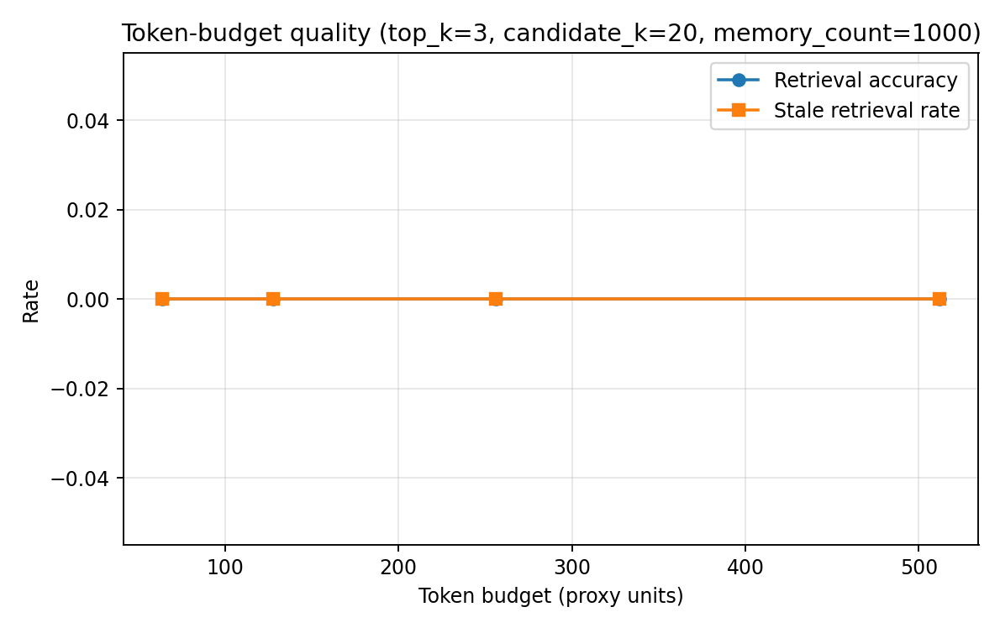
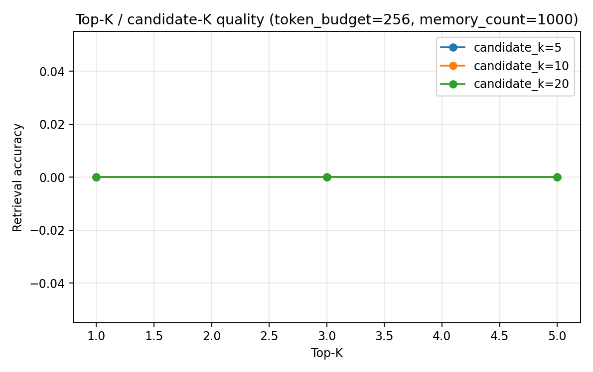
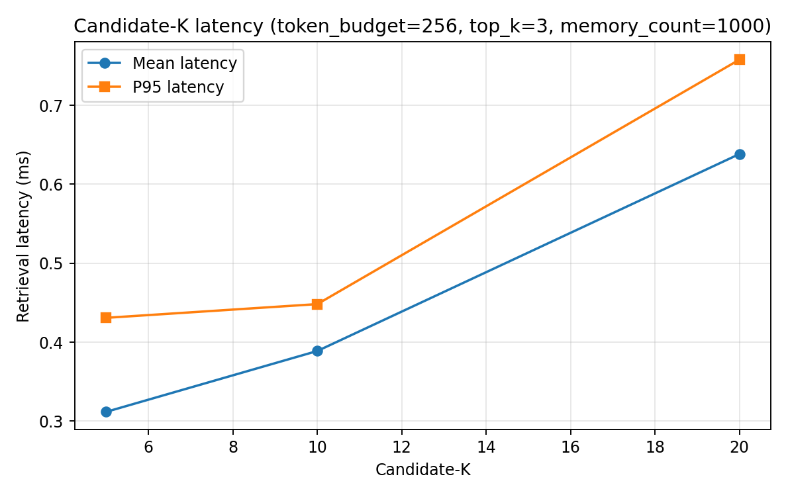
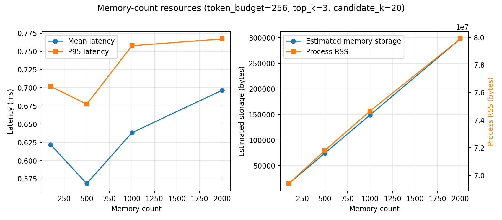
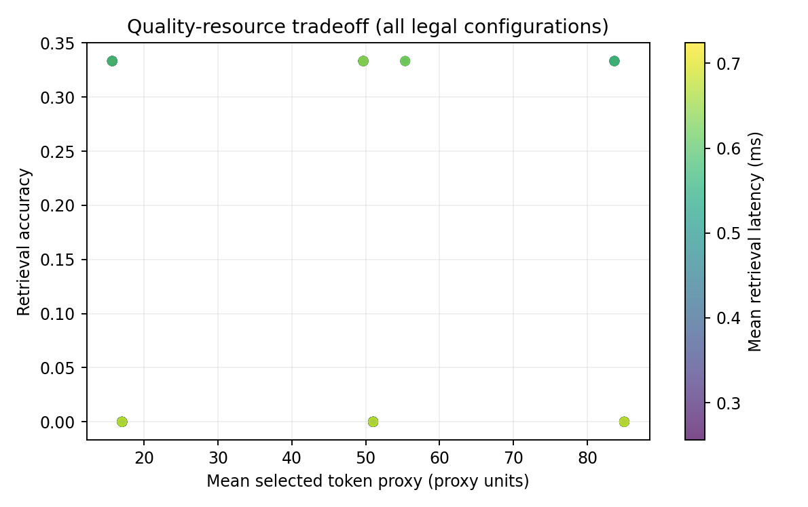

# Budget Sweep Results — 2026-07-16

## 1. 研究问题

本实验分析 `token_budget`、`top_k`、`candidate_k` 和 `memory_count`
对 MemoryBank 受控检索质量与本机资源开销的影响。实验重点是预算维度之间的
quality–resource tradeoff，不修改 Router、Adapter、MemoryBank Core 或正式
fair-comparison 配置。

## 2. 实验边界

- 数据为 3 个 deterministic synthetic budget probes，不是 96-query fair comparison。
- 检索使用 deterministic Hash Embedding 和 MemoryBank 原有 Dense/FAISS 排序。
- 全程 local-only，`cloud_api_used=false`，`llm_called=false`。
- 每次检索显式使用 `reinforce=False`，不同 grid 不共享强化后的状态。
- Template Answer 只做预期关键词覆盖检查，是 deterministic template-answer proxy，
  不是 LLM answer quality。
- 本实验只用于解释预算和资源趋势，不能替代 `results/fair_comparison/` 的正式
  方法优劣结论，也不能直接推广到真实大规模用户数据。

## 3. 可复现设置

- Git commit：`75af1815d1d7160b7ae26320eda447bd49fc2891`
- Run ID：`budget_sweep_20260716`
- Dataset source：`synthetic_memorybank_budget_probe`
- Seed：42
- Grid：token budget 64/128/256/512；Top-K 1/3/5；candidate-K 5/10/20；
  memory count 100/500/1000/2000
- Repeat：3
- Probe count：3
- 合法配置：144；紧凑记录：1296
- Current time：`2026-07-10 10:00`
- Forgetting threshold：0.3
- Reinforcement：关闭
- Embedding：deterministic hash，dimension 32
- Python：3.13.0；平台：Windows 11
- Runner 计时：4001.299 ms
- 输出：`results/budget_sweep/`

仓库相对的复现命令如下：

```powershell
.venv\Scripts\python.exe tools\memorybank\run_budget_sweep.py `
  --results-root results\budget_sweep `
  --run-id budget_sweep_20260716 `
  --token-budget 64 128 256 512 `
  --top-k 1 3 5 `
  --candidate-k 5 10 20 `
  --memory-count 100 500 1000 2000 `
  --forgetting-threshold 0.3 `
  --repeat 3 `
  --seed 42 `
  --embedding-dim 32 `
  --current-time "2026-07-10 10:00"
```

本机仓库没有 `.venv`，正式运行使用已有 Python 3.13.0 解释器执行相同参数；
未安装软件、模型或依赖。Manifest 保存上面的仓库相对复现命令，避免写入个人绝对路径。

## 4. 指标定义

- **Memory retrieval accuracy**：预算选择后的记忆对 probe 相关关键词的覆盖率。
- **Answer proxy accuracy / response correctness**：Template Answer 对预期关键词的
  覆盖率；它不是生成模型答案准确率。
- **Stale retrieval rate**：选中记忆中命中 probe 特定 stale 关键词的比例。
- **Retrieval latency**：`perf_counter_ns` 测得的 Dense retrieval 时间，不包含
  后续 token-budget selection；报告 mean 与 P95。
- **RSS**：用 `psutil.Process(os.getpid()).memory_info().rss` 在 sweep 前后及每次
  检索前后采样的整个 Python 进程常驻物理内存，包含 Python runtime、NumPy、
  FAISS 与已加载依赖；不是 MemoryBank 对象的纯净大小。RSS delta 还会受 allocator
  和操作系统影响。
- **Peak tracemalloc**：Python traced allocation 的峰值，不是 RSS。
- **Estimated memory storage**：MemoryBank 内容、部分元数据、portrait 和 summary
  的 UTF-8 字节估算，不是持久化磁盘文件大小。
- **Estimated FAISS index bytes**：`index_size × embedding_dim × 4` 的 float32
  向量估算，不是持久化 FAISS 文件实测大小。
- **Result artifact bytes**：生成的紧凑 CSV、JSON 与 PNG 文件大小之和。
- **Token proxy**：ASCII 连续字母数字串计 1 个 proxy unit；每个非 ASCII、非空白
  字符计 1 个 proxy unit。

**token proxy 不是任何真实 tokenizer 的 token 统计。** 它不等于模型输入 token
数，结果字段固定标记为 `deterministic_proxy_not_real_tokenizer`。

## 5. 主要结果

### 5.1 Token budget

固定 `top_k=3`、`candidate_k=20`、`memory_count=1000`、threshold 0.3：

| Token budget (proxy) | Retrieval accuracy | Answer proxy | Stale rate | Mean latency (ms) | P95 (ms) | Mean selected proxy |
|---:|---:|---:|---:|---:|---:|---:|
| 64 | 0.0000 | 0.5000 | 0.0000 | 0.5821 | 0.7012 | 51.0 |
| 128 | 0.0000 | 0.5000 | 0.0000 | 0.6414 | 0.7847 | 51.0 |
| 256 | 0.0000 | 0.5000 | 0.0000 | 0.6396 | 0.8070 | 51.0 |
| 512 | 0.0000 | 0.5000 | 0.0000 | 0.6032 | 0.7340 | 51.0 |

64 proxy units 已容纳该锚点返回的 3 条记忆，因此继续增加预算没有增加选中内容或质量。
不同 token budget 的检索延迟差异不是 token 预算造成的算法差异，因为预算选择发生在
Dense retrieval 之后，应视为短运行中的测量波动。

### 5.2 Top-K × candidate-K

固定 `token_budget=256`、`memory_count=1000`、threshold 0.3：

| Top-K | Candidate-K | Retrieval accuracy | Answer proxy | Stale rate | Mean latency (ms) | Mean selected proxy |
|---:|---:|---:|---:|---:|---:|---:|
| 1 | 5 | 0.0000 | 0.5000 | 0.0000 | 0.2744 | 17.0 |
| 1 | 10 | 0.0000 | 0.5000 | 0.0000 | 0.3910 | 17.0 |
| 1 | 20 | 0.0000 | 0.5000 | 0.0000 | 0.5499 | 17.0 |
| 3 | 5 | 0.0000 | 0.5000 | 0.0000 | 0.2999 | 51.0 |
| 3 | 10 | 0.0000 | 0.5000 | 0.0000 | 0.3700 | 51.0 |
| 3 | 20 | 0.0000 | 0.5000 | 0.0000 | 0.6396 | 51.0 |
| 5 | 5 | 0.0000 | 0.5000 | 0.0000 | 0.3484 | 85.0 |
| 5 | 10 | 0.0000 | 0.5000 | 0.0000 | 0.4002 | 85.0 |
| 5 | 20 | 0.0000 | 0.5000 | 0.0000 | 0.5787 | 85.0 |

在 1000-memory 锚点上，扩大 candidate-K 没有改善关键词质量，但
`top_k=3` 时 mean latency 从 0.2999 ms 增至 0.6396 ms。跨全部配置聚合时，
candidate-K 5/10/20 的 retrieval accuracy 分别为 0.0833/0.0833/0.1667，
mean latency 分别为 0.2874/0.3702/0.5680 ms；candidate-K 20 的收益只出现在
部分较小 memory-count 配置，不能概括为普遍收益。

Top-K 1/3/5 的全 grid 平均质量均为 0.1111，但 mean selected proxy 从
16.56 增至 50.56 和 76.53。在本受控数据上，增加 Top-K 只增加上下文成本，
未观察到质量提升或 stale rate 上升。

### 5.3 Memory count

固定 `token_budget=256`、`top_k=3`、`candidate_k=20`、threshold 0.3：

| Memory count | Retrieval accuracy | Answer proxy | Stale rate | Mean latency (ms) | Estimated storage (bytes) | Mean sampled RSS (bytes) |
|---:|---:|---:|---:|---:|---:|---:|
| 100 | 0.3333 | 0.6667 | 0.0000 | 0.4933 | 14,885 | 67,694,592 |
| 500 | 0.3333 | 0.6667 | 0.0000 | 0.5341 | 74,378 | 70,058,439 |
| 1,000 | 0.0000 | 0.5000 | 0.0000 | 0.6396 | 148,743 | 72,941,568 |
| 2,000 | 0.0000 | 0.5000 | 0.0000 | 0.6246 | 297,473 | 78,045,184 |

Estimated storage 从 100 到 2000 memories 增长约 20 倍。关键词质量在 1000
memories 后下降，说明 32 维 hash embedding 在重复合成 filler 下受到碰撞和干扰；
这不是 MiniLM 或真实用户数据上的方法结论。延迟在本次小规模 IndexFlatIP 实验中
变化较小，未观察到严格单调上升。

### 5.4 受控推荐点与正式配置

| 用途 | Token budget | Top-K | Candidate-K | Memory count | Retrieval accuracy | Answer proxy | Mean selected proxy |
|---|---:|---:|---:|---:|---:|---:|---:|
| 本次受控 sweep 的最小成本推荐点 | 64 | 1 | 5 | 100 | 0.3333 | 0.6667 | 15.67 |
| 图表/扩展锚点 | 256 | 3 | 20 | 1000 | 0.0000 | 0.5000 | 51.00 |

受控推荐点是在本 grid 达到最高观测质量的配置中选择最小 token budget、Top-K、
candidate-K 和 memory count 的 proposal；它仍只有 0.3333 的关键词检索准确率，
不能作为生产推荐。

当前 96-query fair comparison 仍固定 `token_budget=256`、`top_k=3`、
`candidate_k=20`。本实验没有修改该配置；是否调整必须在同一正式数据与方法比较
条件下另行验证。

## 6. 图表











## 7. 数据支持的观察

1. 在固定 1000-memory 锚点上，64 proxy units 已容纳全部 Top-3 内容；更高预算
   没有质量收益，表现为预算收益饱和。
2. 在相同锚点上，candidate-K 5→20 增加检索延迟但没有质量收益；全 grid 聚合
   出现部分质量收益，说明收益依赖 memory count，不能单独外推。
3. Top-K 1→5 明显增加 selected token proxy，但本数据未观察到质量变化。
4. Estimated storage 随 memory count 近似线性增长；RSS 总体上升，但不是对象净大小。
5. 所有配置 stale retrieval rate 都是 0，因此本 sweep 不能估计 stale-risk tradeoff；
   过期记忆方法结论仍应引用正式 fair comparison。
6. 1000/2000-memory 的质量下降暴露了低维 hash embedding 与合成 filler 的限制，
   不能据此判断 MemoryBank 或 StateBudgetMem 在语义 embedding 下的总体性能。

## 8. 推荐配置

- **本次受控 sweep 的推荐点：** `token_budget=64`、`top_k=1`、
  `candidate_k=5`、`memory_count=100`。理由仅是它在本 grid 的最高观测质量下使用
  最小预算；这是后续实验 proposal，不自动修改任何配置。
- **当前正式 fair comparison 固定配置：** `token_budget=256`、`top_k=3`、
  `candidate_k=20`，保持不变。正式调整需要在 96-query 数据上重新公平比较。

## 9. 资源结果与局限性

- RSS 可用：true；before 67,833,856 bytes；sampled peak 80,826,368 bytes；
  after 73,420,800 bytes；delta 5,586,944 bytes。
- Peak tracemalloc：5,135,690 bytes；它不是 peak RSS。
- 最大 estimated memory storage：297,473 bytes。
- 最大 IndexFlatIP vector count：2000；最大 estimated FAISS vectors：256,000 bytes。
- Result artifact bytes：2,597,164 bytes。

局限性包括：probe 只有 3 个；Hash Embedding 不是 MiniLM；token 是 proxy；RSS 受
runtime、allocator 与操作系统影响；latency 仅代表本机短运行；Template Answer
不是 LLM；本实验不比较 StateBudgetMem 四种方法的总体优劣，也不能替代
`results/fair_comparison/`。
